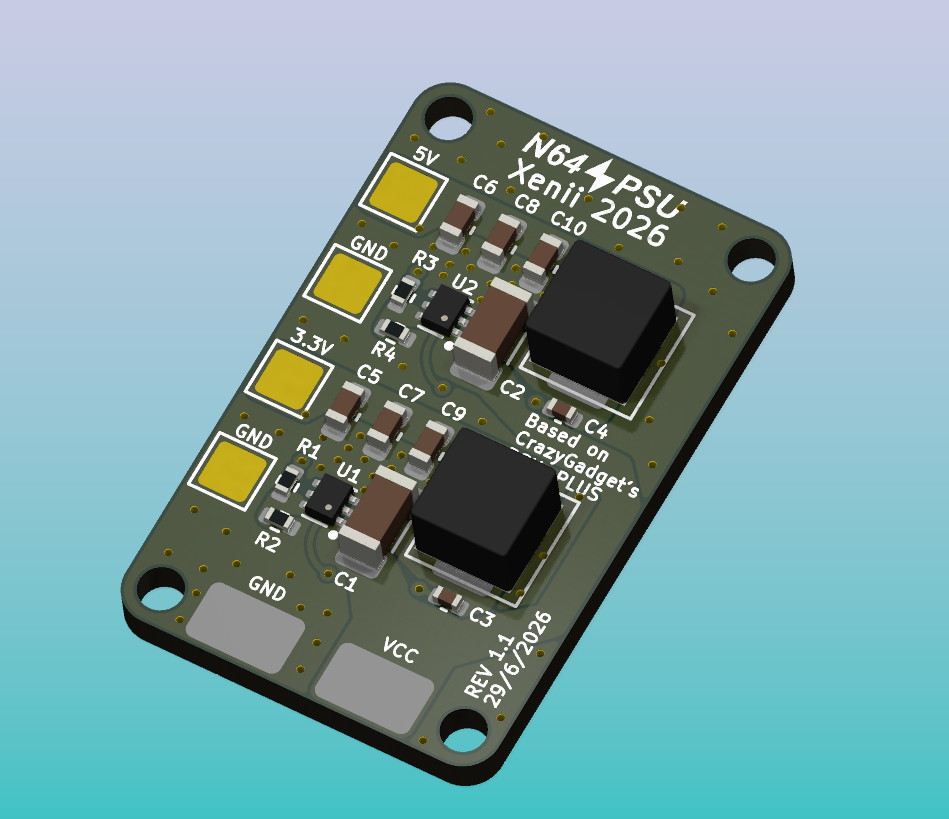
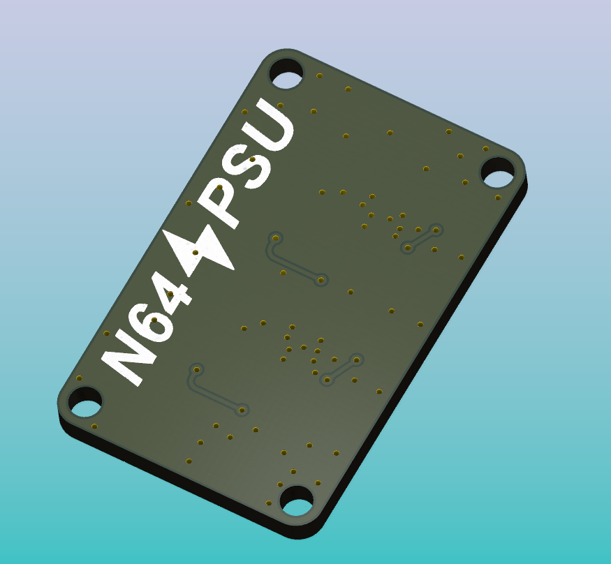
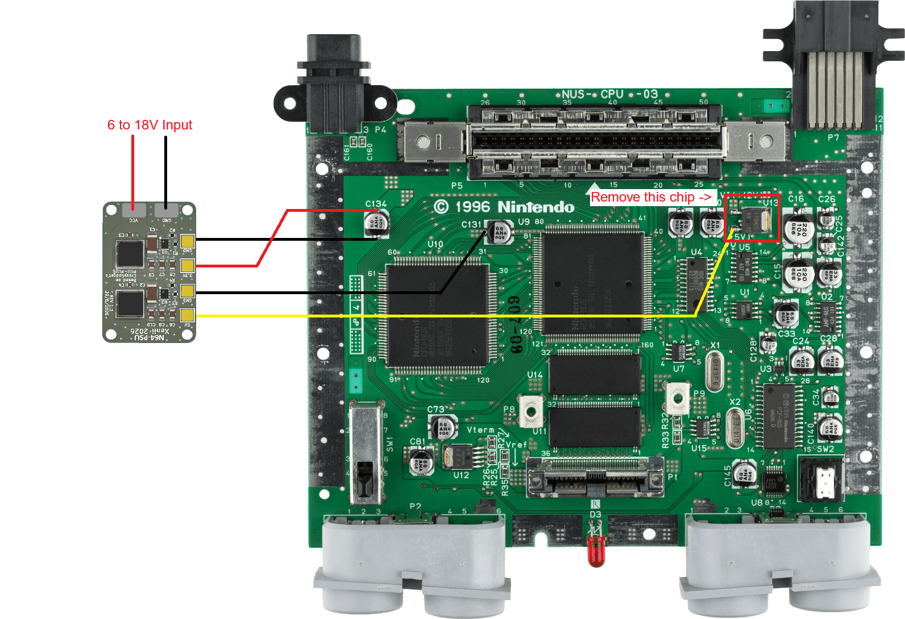

<picture> <source media="(prefers-color-scheme: dark)" srcset="Images/logo-white.png" width="800">  </picture> 
   
   

# Introduction 
The N64-PSU is a simple, compact, cheap and open-source Nintendo 64 Power Supply Unit. 
It can be used to power trimmed Nintendo 64 motherboard, or in builds using the [Matterhorn 64 Core](https://github.com/Xenii1642/Matterhorn-64-CORE/)
Further information can be found on this [BitBuilt Post]

# Caracteristics 
- Input voltage from 6V to 18V
- 3.3V Regulator
- 5V Regulator
- Up to 3A per rail
- 16x25mm form factor

# Ordering
The PCB Gerbers files are available in the [Gerbers folder](https://github.com/Xenii1642/N64-PSU/Gerbers/) of this repository. 
They can be ordered through either [PCBway](www.pcbway.com), [JLCPCB](www.jlcpcb.com) or the manufacturer you want. 

Components are listed in the [BOM.pdf](https://github.com/Xenii1642/N64-PSU/BOM.pdf) file, and can be ordered through [Digikey](www.digikey.com)

# Connection Diagram
The N64-PSU can be connected to a Nintendo 64 motherboard as shown:

⚠️ It is highly recommended to remove the original 12 to 5V LDO (U13) ⚠️

⚠️ Never power the console by both the original power supply and the N64-PSU as the same time.
This will damage and destroy the voltage regulators of the N64-PSU. ⚠️

For further information, please take a look at the [N64 Trimming Guide](https://bitbuilt.net/forums/threads/the-advanced-n64-trimming-guide.3992/)

# License
The N64-PSU is released under the CERN-OHL-S-2.0 license. This license allows you to:

- Study
- Modify
- Manufacture
- Sell
- Distribute

Any modified versions of derivatives must also remain open-source under the same, unmodified license.
You must also properly credit the original creators when reusing or redistributing these files.

# Support
If you notice anything wrong with this design, please let me know! 
You can also reach to me for questions or general help, I'm always happy to help 👍

Thank you for your support and see you next time!
